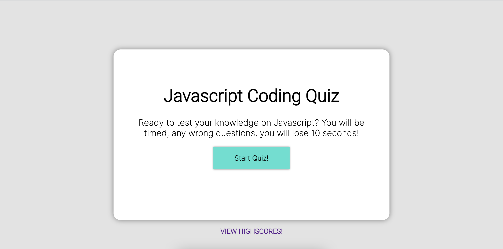
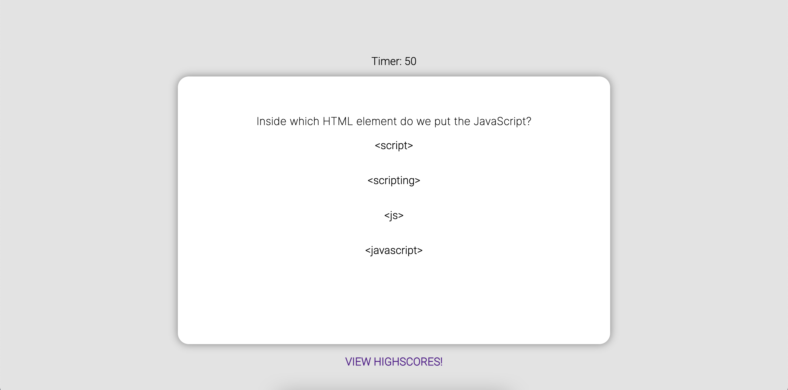
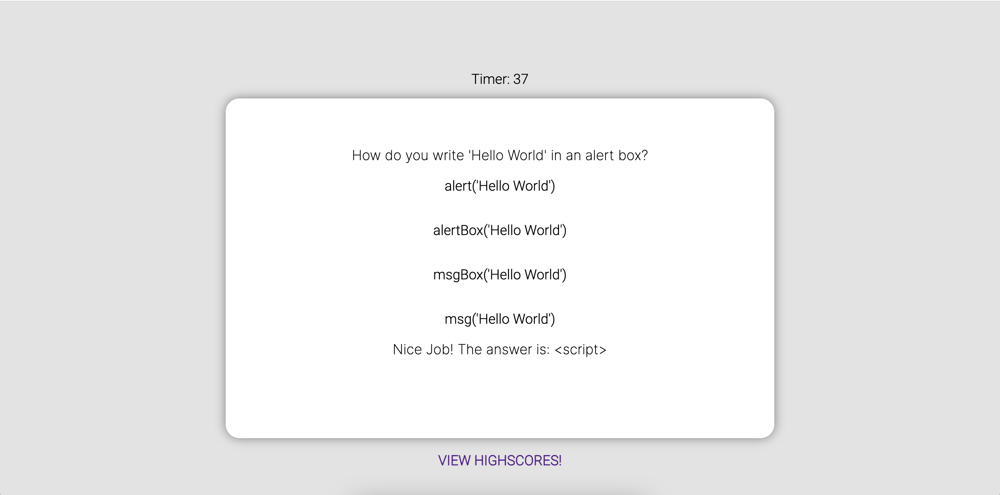
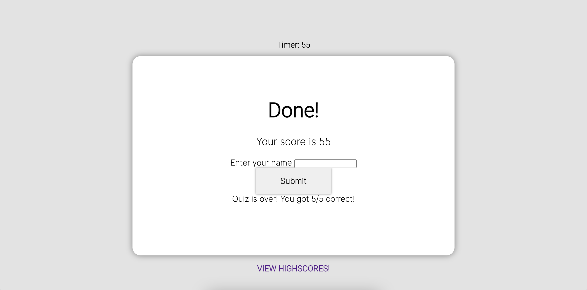

# JS-Quiz

This project was for my UCSD bootcamp, and I must say, this was definitely one of the trickiest ones to figure out. A lot of trial and error but in the end. I am extremely satisfied with myself and learned a lot from just this one project alone.

## Links

## Description 

This project has HTML, CSS, and JS involved. Developing a quiz application based on Javascript and applying what we learned in the past weeks. 

## Installation

To install this project, simply download the zip file or clone the SSH key to your terminal. GitHub has instructions on how to do this.

## How it works?

- Simply click on Start Quiz! button to begin.

- Once clicked, a timer should appear and each question you get wrong, you'll get penalized 10 seconds.

- If the answer is correct or wrong, a message will appear below the options.

- Once all 5 questions has been answered, you will be presented with a score and a place to input your name.

