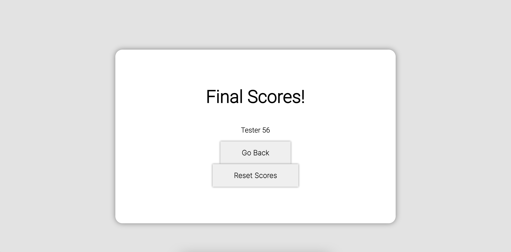

# JS-Quiz

This project was for my UCSD bootcamp, and I must say, this was definitely one of the trickiest ones to figure out. A lot of trial and error but in the end. I am extremely satisfied with myself and learned a lot from just this one project alone.

## Demo & Repository

- [GitHub Repo](https://github.com/latommyla/JS-Quiz)
- [GitHub Deployed Live URL](https://latommyla.github.io/JS-Quiz/)

## Description 

Developing a quiz application based on Javascript and applying what we learned in the past weeks.

## What was used in this project?

- HTML
- CSS
- JQuery

## Installation

To install this project, simply download the zip file or clone the SSH key to your terminal. GitHub has instructions on how to do this.

## How it works?

- Simply click on Start Quiz! button to begin.

- When clicked, a timer should appear and each question you get wrong, you'll get penalized 10 seconds.

- If the answer is correct or wrong, a message will appear below the options.

- When all 5 questions has been answered, you will be presented with a score and a place to input your name.

- After your name has been inputed and submitted, you will be present with your current and previous scores. Can reset all the scores, or go back to the main page (index.html).

## Contact 

- [My Gmail](mailto:tommyl.dmd@gmail.com)
- [GitHub](https://github.com/latommyla)
- [Instagram](https://www.instagram.com/latommyla/)